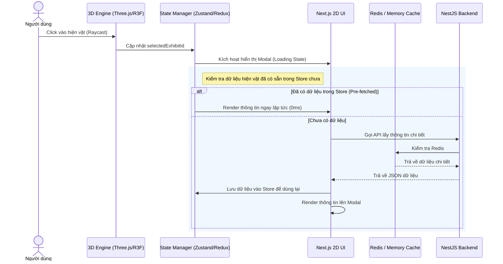

# BÁO CÁO PHÂN TÍCH THIẾT KẾ: HỆ THỐNG BẢO TÀNG ẢO 3D (3D VIRTUAL MUSEUM PLATFORM)

Báo cáo này phân tích chi tiết tài liệu thiết kế của hệ thống **Bảo tàng ảo 3D** dựa trên file thiết kế [thiet-ke-du-an-bao-tang-3d.md](file:///d:/FPT_University/SU26/MLN122/project/thiet-ke-du-an-bao-tang-3d.md). Nội dung tập trung vào đánh giá tính khả thi, chỉ ra các điểm nghẽn tiềm ẩn, và đề xuất các giải pháp tối ưu hóa về mặt kỹ thuật, dữ liệu và hiệu năng.

---

## 1. ĐÁNH GIÁ TỔNG QUAN HỆ THỐNG

Hệ thống được thiết kế theo mô hình phân lớp rõ ràng (3-tier architecture): **Core 3D Engine (WebGL)**, **UI Overlay (Next.js)**, và **Backend API (NestJS + PostgreSQL + Redis)**. Đây là một kiến trúc hiện đại, phân tách rõ ràng trách nhiệm của từng lớp (Separation of Concerns).

### Điểm mạnh nổi bật:
* **Kiến trúc Module hóa cao:** Việc sử dụng NestJS ở Backend và Next.js ở Frontend giúp hệ thống dễ bảo trì và mở rộng.
* **Chiến lược Caching thông minh:** Áp dụng Redis cache cho dữ liệu tọa độ hiện vật (`gallery:{id}:exhibits`) giúp giảm thiểu tải cho database PostgreSQL khi có số lượng lớn người dùng tải bản đồ cùng lúc.
* **Tối ưu hạ tầng mạng:** Việc sử dụng Cloudflare R2 (không tốn chi phí băng thông tải ra - egress fee) kết hợp Cloudflare CDN là lựa chọn tối ưu cho các dự án chứa nhiều tài nguyên nặng như mô hình 3D (.glb).

---

## 2. PHÂN TÍCH KỸ THUẬT & TRẢI NGHIỆM ĐỒ HỌA (3D ENGINE LAYER)

Tài liệu hiện đang cân nhắc giữa hai giải pháp: **Unity WebGL** và **Three.js / React Three Fiber (R3F)**. Đây là quyết định ảnh hưởng lớn nhất đến hiệu năng và trải nghiệm người dùng trên môi trường Web.

### So sánh & Đề xuất lựa chọn:

| Tiêu chí | Unity WebGL | Three.js / React Three Fiber (R3F) |
| :--- | :--- | :--- |
| **Dung lượng Build** | **Lớn (Thường > 20MB - 100MB)**. Thời gian tải ban đầu (Initial Load) rất lâu trên mobile/mạng yếu. | **Nhẹ (Vài trăm KB đến vài MB)**. Tải cực nhanh, tối ưu hóa bundle tốt. |
| **Hiệu năng & Web** | Tốn nhiều tài nguyên CPU/RAM của trình duyệt do chạy qua lớp biên dịch WebAssembly (Wasm). Dễ crash trên trình duyệt di động. | Chạy mượt mà, tối ưu trực tiếp với WebGL của trình duyệt, tương thích tốt với các thiết bị di động cấu hình trung bình. |
| **Giao tiếp với UI Web** | Phức tạp. Cần viết cầu nối (JS Bridge) thông qua `SendMessage` và JSON stringify, có độ trễ và khó debug. | **Tự nhiên & Trực tiếp**. R3F là wrapper của React, quản lý state đồng bộ hoàn toàn với React Context, Redux hoặc Zustand. |
| **Khả năng SEO** | Gần như bằng 0 đối với các nội dung bên trong môi trường 3D của Unity. | Tốt. Dễ dàng render SSR hoặc SSG các thông tin hiện vật bên cạnh canvas 3D để các bot tìm kiếm (Google, Bing) lập chỉ mục. |
| **Quy trình phát triển** | Phù hợp nếu đã có sẵn file thiết kế không gian từ Unity Editor và đội ngũ quen thuộc với C# / Unity. | Phù hợp cho việc phát triển web chuyên nghiệp, dễ dàng tùy biến giao diện bằng HTML/CSS/Tailwind bên ngoài. |

> [!IMPORTANT]
> **Khuyến nghị:** Đối với một nền tảng chạy trên Web (nhất là Web di động), **React Three Fiber (R3F)** là lựa chọn vượt trội hơn so với Unity WebGL. R3F giúp giảm thời gian tải trang (Time to Interactive), đồng bộ dữ liệu UI cực kỳ dễ dàng và hỗ trợ tối ưu SEO tốt hơn cho các trang chi tiết hiện vật.

---

## 3. PHÂN TÍCH & ĐỀ XUẤT CẢI TIẾN CƠ SỞ DỮ LIỆU (DATABASE DESIGN)

Thiết kế cơ sở dữ liệu hiện tại trong file `thiet-ke-du-an-bao-tang-3d.md` đã bao quát được cấu trúc cơ bản, tuy nhiên để đưa vào vận hành thực tế cần bổ sung một số điểm quan trọng sau:

### 3.1. Thiếu thông tin về Góc quay (Rotation) và Tỉ lệ (Scale) của Hiện vật
Bảng `exhibits` hiện tại chỉ lưu trữ tọa độ vị trí `coordinate_x`, `coordinate_y`, `coordinate_z`.
* **Vấn đề:** Trong không gian 3D, một hiện vật khi được đặt vào phòng trưng bày không chỉ cần vị trí đặt mà còn cần hướng quay (ví dụ: quay mặt bức tranh hướng ra cửa, xoay tượng góc 45 độ) và tỉ lệ kích thước phóng to/thu nhỏ (Scale). Nếu chỉ có tọa độ, tất cả các hiện vật sẽ cùng quay về một hướng mặc định và cùng một kích cỡ.
* **Đề xuất:** Bổ sung thêm các trường:
  * `rotation_x`, `rotation_y`, `rotation_z` (hoặc lưu dạng Quaternion/Euler Angles) để định vị hướng quay của vật thể.
  * `scale_x`, `scale_y`, `scale_z` (mặc định là 1.0) để điều chỉnh kích thước vật thể phù hợp với không gian.

### 3.2. Hỗ trợ Đa ngôn ngữ (i18n) cho Hiện vật
Bảo tàng ảo thường phục vụ cả khách du lịch quốc tế, do đó thông tin hiện vật cần được hiển thị bằng nhiều ngôn ngữ (ít nhất là Tiếng Việt và Tiếng Anh).
* **Vấn đề:** Bảng `exhibits` đang lưu trực tiếp `title` và `description` dạng TEXT thông thường. Điều này giới hạn hệ thống chỉ hiển thị được một ngôn ngữ duy nhất.
* **Đề xuất:** Có hai giải pháp:
  1. Sử dụng kiểu dữ liệu `JSONB` cho `title` và `description` (Ví dụ: `{"vi": "Tác phẩm A", "en": "Artwork A"}`).
  2. Tạo bảng phụ `exhibit_translations` để lưu bản dịch theo locale (sạch sẽ hơn cho việc lập chỉ mục tìm kiếm).

### 3.3. Tối ưu hóa Indexing
Cần tạo thêm Composite Index cho bảng `exhibits` trên các trường `gallery_id` và `is_active` (nếu có) để tăng tốc độ truy vấn khi lấy toàn bộ hiện vật của một phòng triển lãm:
```sql
CREATE INDEX idx_exhibits_gallery_active ON exhibits(gallery_id) WHERE model_3d_url IS NOT NULL;
```

---

## 4. PHÂN TÍCH LUỒNG TƯƠNG TÁC (3D - WEB UI SYNC)

Luồng tương tác mô tả trong tài liệu (Raycast -> Web Bridge -> Next.js State -> API Call -> Show Modal) là chuẩn xác. Tuy nhiên, để tăng hiệu năng và trải nghiệm người dùng, ta có thể tối ưu luồng này như sau:



### Giải pháp tối ưu: Pre-fetching Metadata
Thay vì đợi người dùng click vào hiện vật mới bắt đầu gọi API để lấy thông tin chi tiết (`description`), khi người dùng vừa bước vào một phòng triển lãm (`gallery`), Next.js nên gọi một API duy nhất để lấy toàn bộ danh sách hiện vật kèm thông tin chi tiết ngắn gọn của phòng đó. Dữ liệu này được lưu vào Client State Manager (ví dụ: Zustand).
* **Ưu điểm:** Khi click vào hiện vật, thông tin sẽ hiển thị ngay lập tức (0ms) mà không phải hiển thị trạng thái xoay vòng tải (loading spinner) chờ API phản hồi.

---

## 5. TỐI ƯU HÓA HIỆU NĂNG TÀI NGUYÊN 3D (ASSETS OPTIMIZATION)

Đây là yếu tố sống còn quyết định sự thành bại của ứng dụng bảo tàng 3D. Nếu file quá nặng, người dùng sẽ thoát trang trước khi tải xong.

### Các kỹ thuật tối ưu hóa tài nguyên bắt buộc:
1. **Draco Compression:** Nén các file `.glb`/`.gltf` sử dụng thư viện Draco. Kỹ thuật này có thể giảm kích thước file 3D từ 70% - 80% mà không làm giảm đáng kể chất lượng hình học của mô hình.
2. **Texture Compression:**
   * Sử dụng định dạng ảnh **WebP** hoặc **Basis Universal (KTX2)** cho các hình ảnh texture bề mặt thay vì PNG hoặc JPEG.
   * Giới hạn độ phân giải texture (ví dụ: 1K hoặc tối đa 2K đối với các hiện vật cực kỳ quan trọng, tránh dùng texture 4K không cần thiết).
3. **Level of Detail (LOD):**
   * Đối với các hiện vật ở xa camera, hiển thị phiên bản mô hình có số lượng đa giác (polygon count) thấp.
   * Khi camera di chuyển lại gần, tự động tráo đổi sang phiên bản chi tiết cao (high-poly).
4. **Occlusion Culling & Frustum Culling:**
   * Chỉ render những hiện vật nằm trong tầm nhìn của camera (Frustum).
   * Không render các hiện vật bị che khuất bởi các bức tường hoặc hiện vật lớn khác (Occlusion).

---

## 6. ĐÁNH GIÁ CHIẾN LƯỢC TRIỂN KHAI VÀ DEPLOYMENT

Phương án triển khai được đề xuất trong tài liệu rất thực tế và tuân thủ các tiêu chuẩn công nghiệp:
* **Cloudflare R2:** Là sự lựa chọn thông minh nhất hiện nay để lưu trữ 3D Assets lớn nhờ chính sách **miễn phí băng thông truyền tải dữ liệu ra (Zero Egress Fees)**.
* **Next.js trên Vercel / Netlify:** Tối ưu hóa tính năng Edge Middleware và SSR, hỗ trợ SEO cực tốt cho các trang chi tiết tác phẩm nghệ thuật.
* **NestJS trên Docker Container (Railway/Render/AWS):** Giúp môi trường chạy Backend đồng nhất, dễ dàng CI/CD và scale theo chiều ngang (Horizontal Scaling) khi lượng truy cập tăng đột biến.

---

## 7. KẾT LUẬN & ĐỀ XUẤT CÁC BƯỚC TRIỂN KHAI TIẾP THEO

Tài liệu thiết kế đã đặt một nền móng vững chắc cho dự án **Bảo tàng ảo 3D**. Để hiện thực hóa dự án này một cách hiệu quả, dưới đây là các bước tiếp theo được khuyến nghị:

1. **Chốt Công nghệ 3D Engine:** Lựa chọn **React Three Fiber (R3F)** để có sự tích hợp mượt mà nhất với Next.js và Tailwind CSS.
2. **Cập nhật Thiết kế Database:** Cập nhật bảng `exhibits` để bổ sung thêm các cột `rotation` và `scale` cũng như cơ chế hỗ trợ đa ngôn ngữ.
3. **Xây dựng Prototype:** Tạo một không gian phòng triển lãm đơn giản (một phòng trống) và thử nghiệm tính năng kéo thả, đặt hiện vật trên trang quản trị (Admin CMS) để kiểm tra tính khả thi của tính năng cấu hình tọa độ trực quan.
